# Ultimate MeshCore (UMC)

**All-in-one mesh radio firmware with a complete WiFi web interface, a feature-packed client, a touch client for the T-Deck, an Android app and a Windows / Linux desktop app.**
Set up, manage and update every node from any browser, phone or computer.

By **Daren Loxley 2E0LXY**

[**⚡ Install with the USB web flasher**](https://2e0lxy.github.io/ultimate-meshcore/) · [**📖 User manual (A–Z)**](docs/umc/MANUAL.md) · [**⬇ Latest firmware**](https://github.com/2E0LXY/ultimate-meshcore/releases/tag/latest) · [**📱 Android app**](https://github.com/2E0LXY/ultimate-meshcore/releases/tag/app-latest) · [**🖥 Windows / Linux app**](https://github.com/2E0LXY/ultimate-meshcore/releases/tag/desktop-latest)

> **Status: 0.1.0 (early).** The Heltec V3 / V3.2 **repeater** and **Ultimate MeshCore Client** run on hardware. Heltec V4 (OLED/TFT/R8) and T-Deck builds are published but not yet tested on that hardware. Room server and the T-TWR are in progress; see the [roadmap](docs/umc/ROADMAP.md).

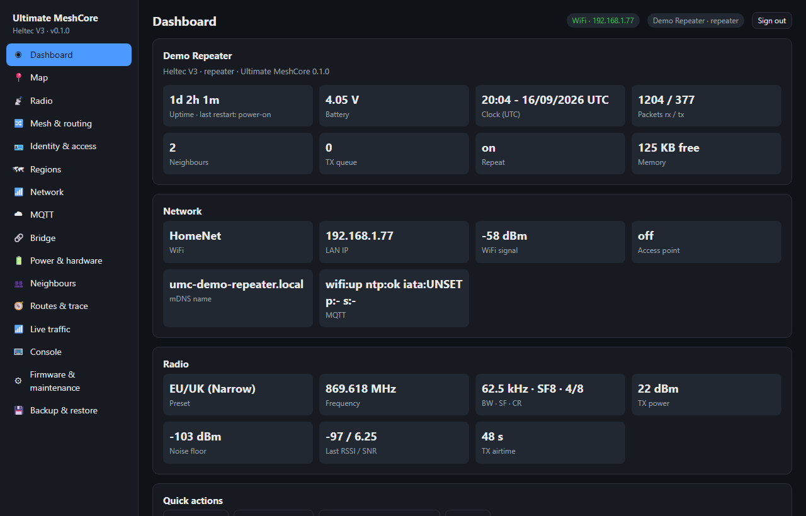

---

## Contents

- [Supported hardware](#supported-hardware)
- [Quick start](#quick-start)
- [Installation and updates](#installation-and-updates)
- [First-time setup](#first-time-setup)
- [Repeater web interface](#repeater-web-interface)
- [WiFi and networking](#wifi-and-networking)
- [Display](#display)
- [Ultimate MeshCore Client](#ultimate-meshcore-client)
- [T-Deck / T-Deck Plus touch client](#t-deck--t-deck-plus-touch-client)
- [Ultimate MeshCore App (Android)](#ultimate-meshcore-app-android)
- [Ultimate MeshCore Desktop (Windows / Linux)](#ultimate-meshcore-desktop-windows--linux)
- [Command line](#command-line)
- [Building](#building)
- [Documentation](#documentation)

---

## Supported hardware

| Board | Repeater | Client | Room server |
|---|---|---|---|
| Heltec WiFi LoRa 32 V3 / V3.2 | ✅ | ✅ | planned |
| Heltec V4 OLED / TFT / R8 | ✅ build (hardware test pending) | ✅ build (hardware test pending) | planned |
| LilyGo T-Deck / T-Deck Plus | — | ✅ touch UI, maps and GPS (hardware test pending) | — |
| LilyGo T-TWR + SX1262 add-on | planned | planned | — |

## Quick start

1. Open the [web flasher](https://2e0lxy.github.io/ultimate-meshcore/) in Chrome or Edge. Choose your board and **Repeater** or **Ultimate MeshCore Client**, then press **Install**. Choose **No** at “Erase device?” to keep an existing node's identity.
2. Join the open `UMC-Setup-XXXX` WiFi hotspot. The setup wizard opens by itself.
3. Reconnect to your home WiFi and open `http://umc-<name>.local/`, or the IP address shown on the display.

---

## Installation and updates

- **USB web flasher** (Chrome/Edge). It always installs the newest build. It can **update** (keeping identity and settings) or do a **fresh install**.
- **Update through the browser**: your browser fetches the latest build for this exact board and firmware type and sends it to the device. The device itself needs no internet access.
- **Internet updates on the device**: checks and installs over verified HTTPS, with optional daily automatic checks or installs. The Heltec V3 client restarts into a short **update mode** with Bluetooth off, then returns to normal by itself.
- **Upload a firmware file** in the browser. Images are validated: merged or wrong-chip images are rejected, and a wrong board or firmware type gets a warning.
- **Automatic rollback**: an update must run healthily for 60 s, or the device returns to the previous firmware. `ota rollback` rolls back on demand.
- **Loop watchdog**: a hung device restarts itself, and the reset reason is shown on the dashboard.
- Legacy `start ota` hotspot, esptool, and **automatic CI builds** of every target on each push.

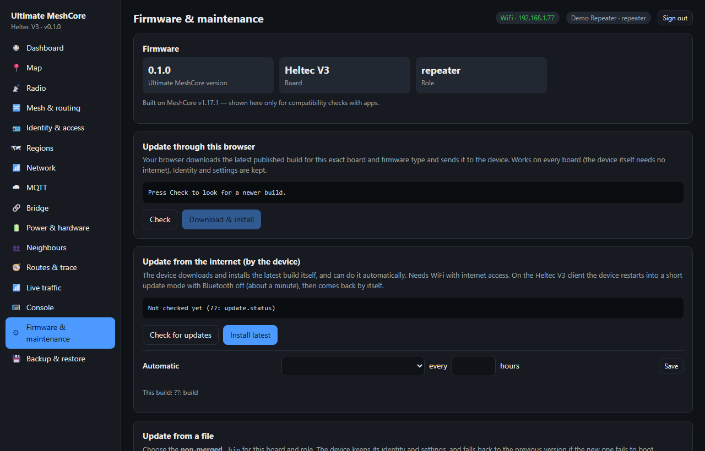

## First-time setup

- **Open setup hotspot** `UMC-Setup-XXXX` with a captive portal: join it and the setup page opens.
- **Setup wizard** covers:
  - radio preset, TX power and duty cycle (suggests 10 % in the UK/EU 869.4–869.65 MHz band);
  - name, and location picked from a map (rounded to ~100 m);
  - admin and guest passwords;
  - WiFi with a network scan, and telnet;
  - MQTT location code;
  - clock set from the browser.
- Existing settings are kept, and only what you change is applied. Re-run the wizard at any time.

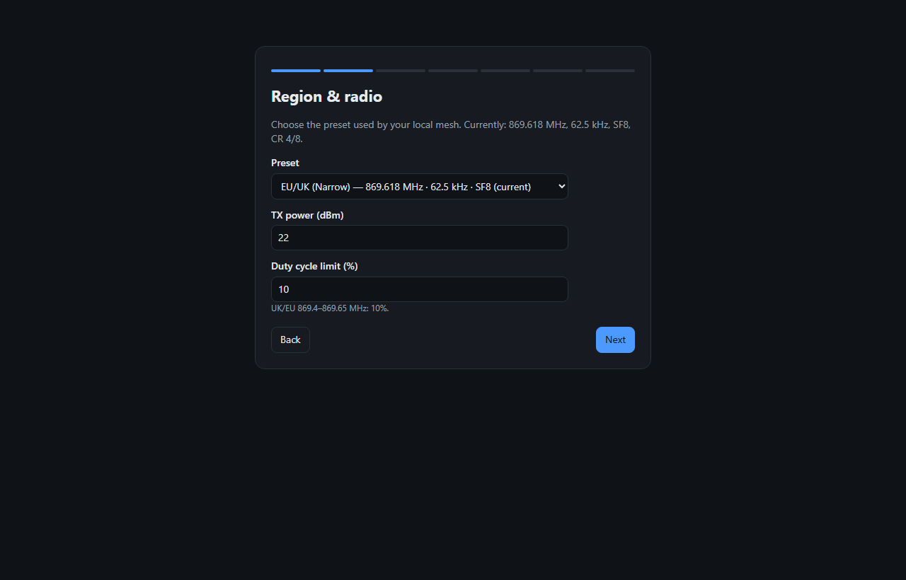

---

## Repeater web interface

Every setting is available from the browser. The pages work on phones and support light and dark themes.

### Dashboard
Shows uptime, battery, clock, packets, neighbours, queue, memory, WiFi, hotspot and MQTT. It also shows the radio preset, noise floor, RSSI/SNR and airtime, plus quick actions and an update banner (screenshot at the top of this page).

### Radio
- **Regional presets** and frequency/BW/SF/CR, **applied without a reboot**.
- TX power, duty cycle and RX gain.
- AGC reset, CAD and interference threshold.
- Temporary radio test.

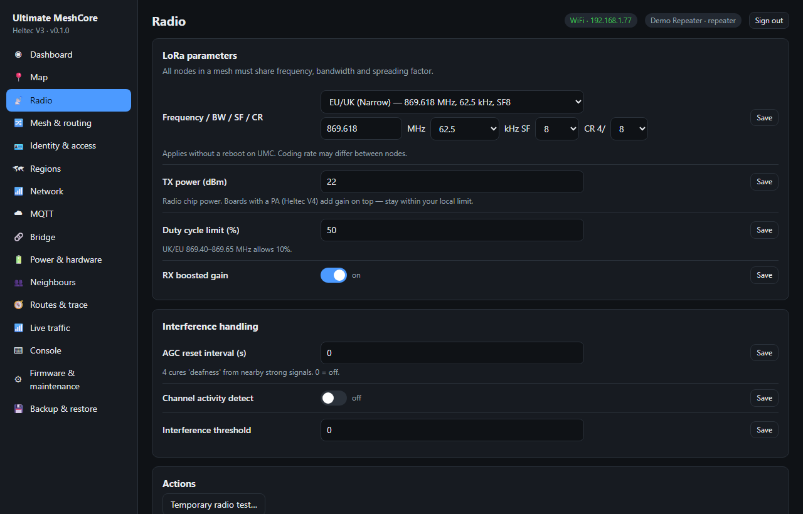

### Mesh & routing
- Repeat, loop detection and path hash size.
- Hop limits for flood, unscoped, advert and **channel** traffic.
- Extra ACKs, and TX/direct/RX delays.
- Advert intervals, send adverts, and discover neighbours.
- **Neighbours** list with age and SNR, forget and discover.

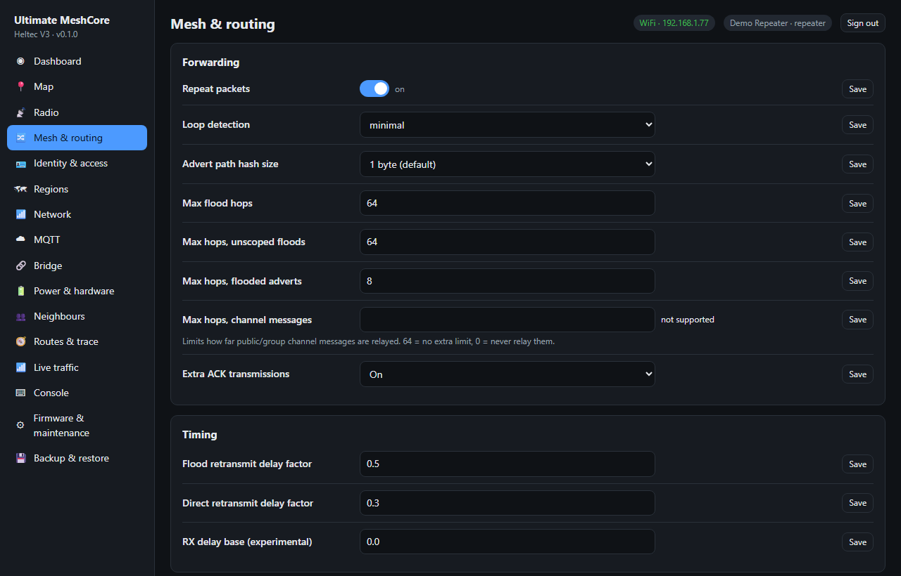

### Identity & access
- Name, location (map picker) and owner info.
- Admin and guest passwords.
- Public key, and private key export/import.
- ACL permissions.

### Regions and the Yorkshire recommended settings
- **Tree view** of regions. Each region has a **flooding switch**, **set home** and **remove** (sub-regions are removed first).
- **UK presets** `yorkshire`, `northwest` and `uk`, plus add and one-line definitions, with a reminder about unsaved changes.
- **Yorkshire mesh recommended settings** in one click: flood limits, advert intervals, duty cycle and regions from the [Yorkshire suggested repeater commands](https://docs.meshcoreyorkshire.uk/repeaters/suggested-repeater-commands/).

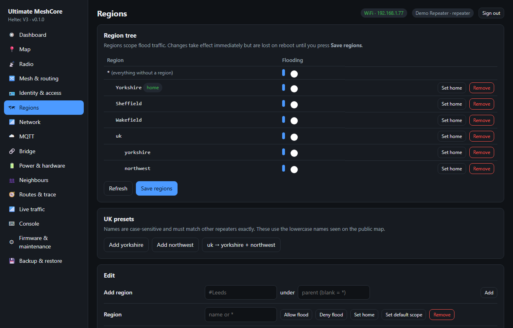

### Network
- **3 saved WiFi networks** with scan.
- Static IP or DHCP, hostname and `.local` name.
- Hotspot mode (auto/on/off), rescue delay, and hotspot password/PIN.
- Session timeout, telnet, NTP servers and time zone.

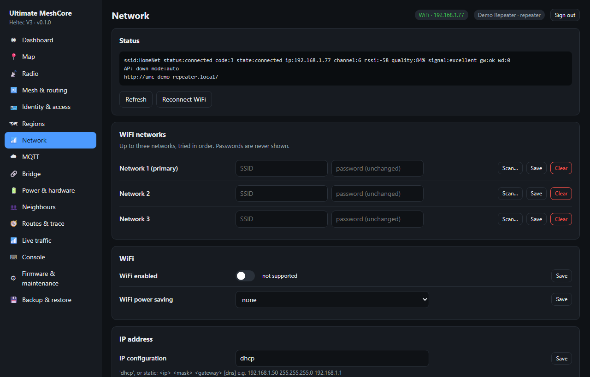

### MQTT, bridge, power
- **MQTT observer**: location code, identity and what to publish. Choose a preset broker or a custom TCP/WSS broker (JWT supported), with two broker slots and a status view.
- **ESP-NOW bridge** between nearby LoRa segments (channel, secret, delay, source), and RS-232 settings.
- **Power & hardware**: power saving, battery calibration, GPS, display cycle settings and board info.

### Routes & trace
- **Route table** learned from adverts, showing the hop chain with repeater names.
- Find a route, and **add or pin a route**.
- **Trace** a path out and back, with SNR for each hop.
- Forget a route.

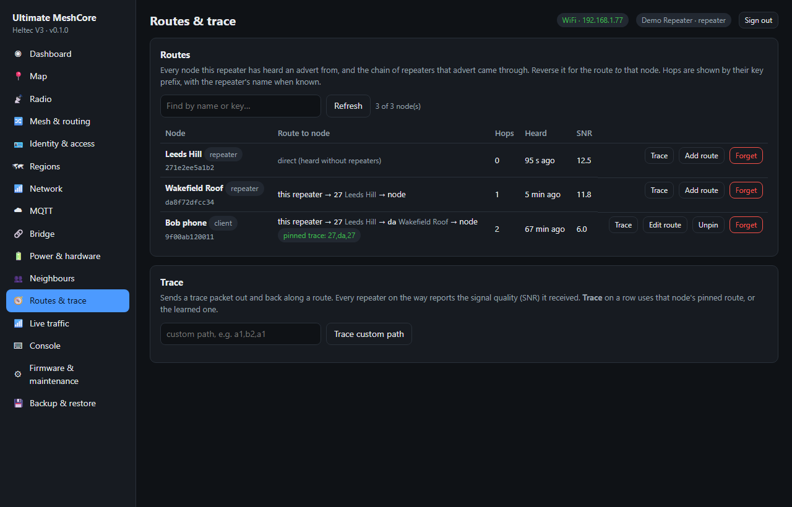

### Live traffic
Packet list with type, route, hops, RSSI and SNR, plus filters and per-minute counts.

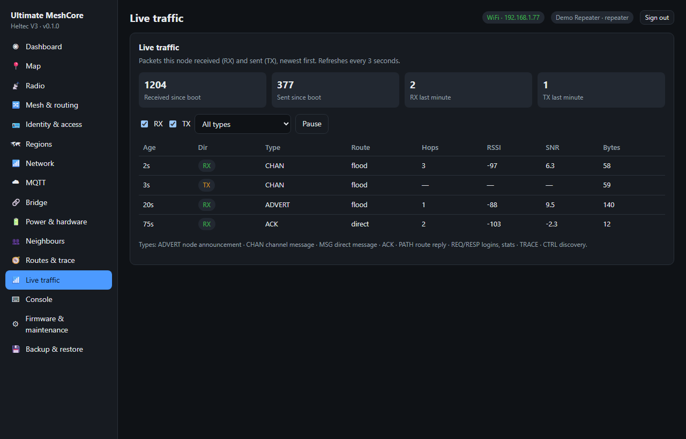

### Map
Every node that shares a location, on an OpenStreetMap map.

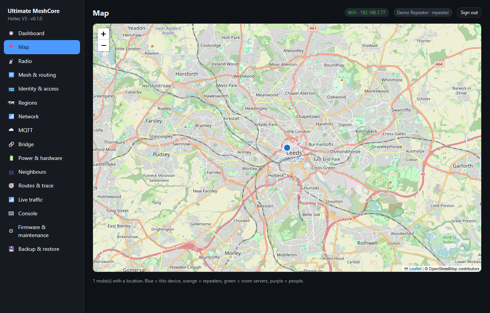

### Console, maintenance, backup
- **Console**: the full command line, with history.
- **Firmware & maintenance**: browser update, internet update, file update, clock sync, reboot, stats/log controls, legacy OTA, re-run setup, power off and factory reset.
- **Backup & restore**: JSON backup with a preview before restoring. Passwords are excluded, and the private key is optional.
- **Sign-in** with session timeout and lockout.
- A “device not reachable” screen that reconnects automatically.
- Optional HTTPS stats panel with history.

---

## WiFi and networking

- Up to **three networks**, tried in order, with a gateway watchdog and automatic reconnect.
- **Rescue hotspot** when no saved network is reachable (PIN protected). It can also be set to always on or never.
- Static IP, custom hostname, **mDNS** (`http://umc-<name>.local/`), network scan and captive portal.
- **Telnet** command line on port 23. It is password protected and off by default.
- **App connection on TCP port 5000**: companion apps and Home Assistant connect over WiFi. On a repeater, log in to its **(console)** contact to get status, telemetry, neighbours and the command line.
- Time sync from NTP (UK servers by default). Mesh time stays UTC.

## Display

- **Screen cycle**: **flashing IP address** → radio → mesh → WiFi → status → **live packet traffic**.
- All timings are adjustable. Modes are cycle, status or off, with a blank-after timeout.
- The button steps through screens, and a long press powers off.
- The start screen shows **Ultimate MeshCore**, the version, and **By Daren Loxley 2E0LXY**.
- Setup and rescue screens show the hotspot name and whether it has a password.

---

## Ultimate MeshCore Client

A companion radio with every app link and a complete messenger built into its web page.

- **Every app link at once**:
  - Bluetooth (PIN pairing);
  - USB;
  - **WiFi TCP port 5000** (up to 3 apps);
  - the browser.

### Messages
- Channels and direct messages.
- **Delivery ticks** with round-trip time, plus hops/SNR and retry.
- Search and unread counts.
- History kept on the device and in the browser.
- Room-server login.

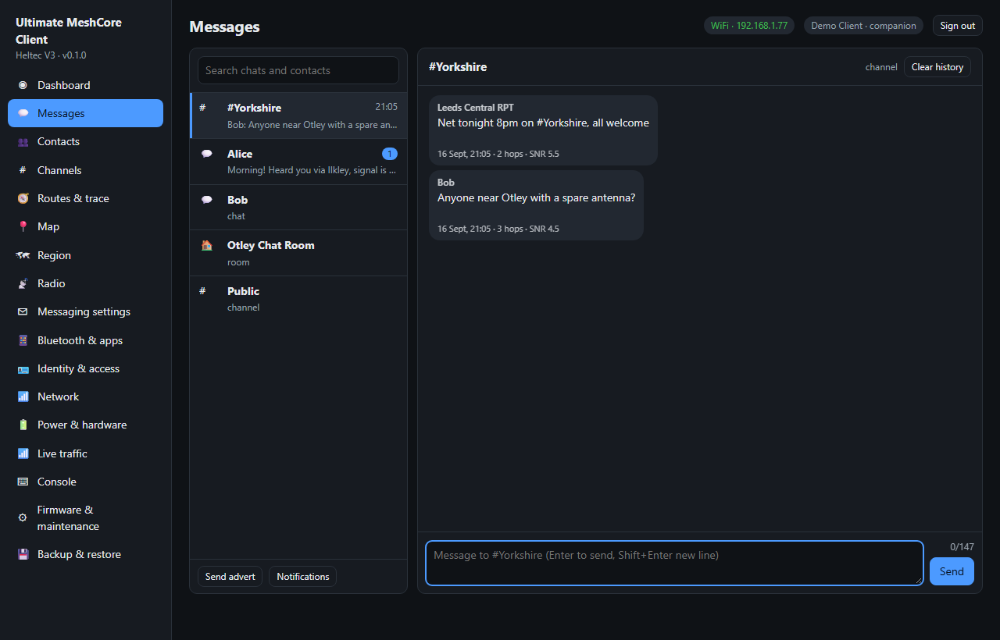

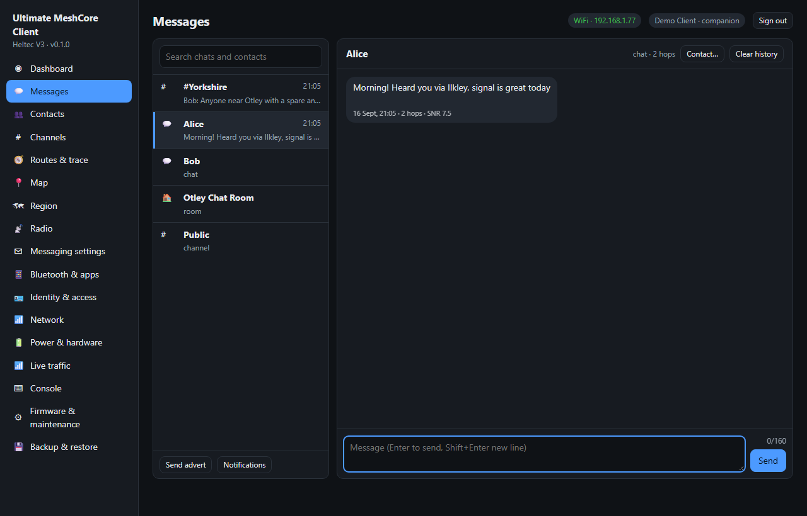

### Contacts and repeater tools
- **Contact details**: type, path, advert age and map position.
- **Contact actions**: favourites, remove, reset path and share.
- `meshcore://` export/import, and a list of adverts waiting to be added.
- **Over the mesh**: login, status, telemetry (Cayenne LPP decoded) and a **remote admin console**.
- **Set route…** to define the path to a contact by hand.
- **Trace path** with SNR for each hop, **Trace custom path…**, and **discover path**.

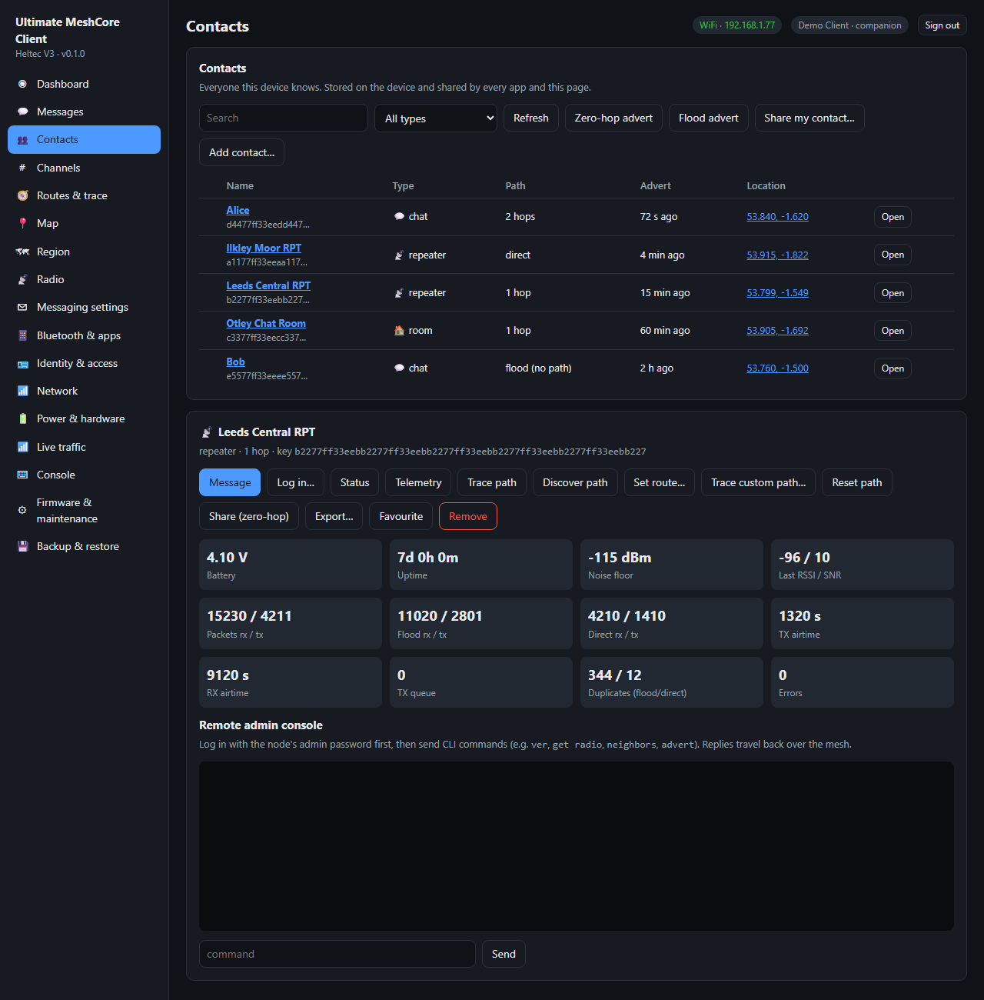

### Routes & trace
- Every known route, shown with repeater names.
- Define or reset a route.
- Trace any hop list, with SNR for each hop.

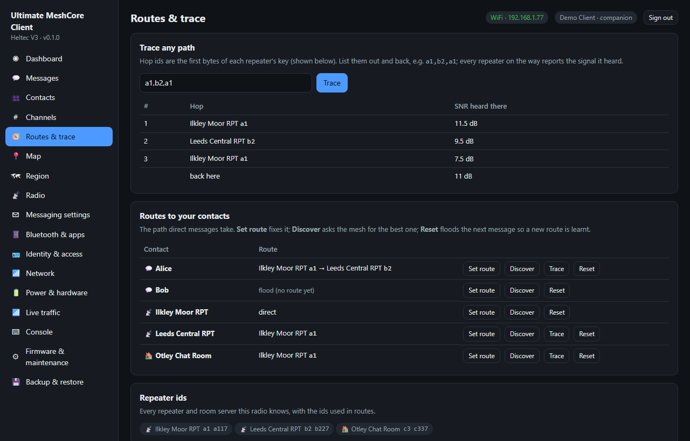

### Channels and region scope
- **Channel types**: hashtag, private (random secret), shared secret, and Public.
- Share, remove, and export/import channels.
- **Region scope** for each channel, so sends reach only that region's repeaters.
- **Region page** with one-tap **Yorkshire** (`#Yorkshire` channel, `yorkshire` scope) and **North West** presets, plus a default scope for all sends.

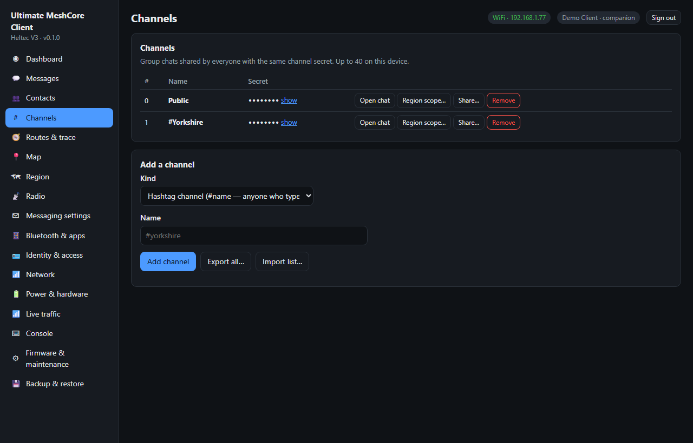

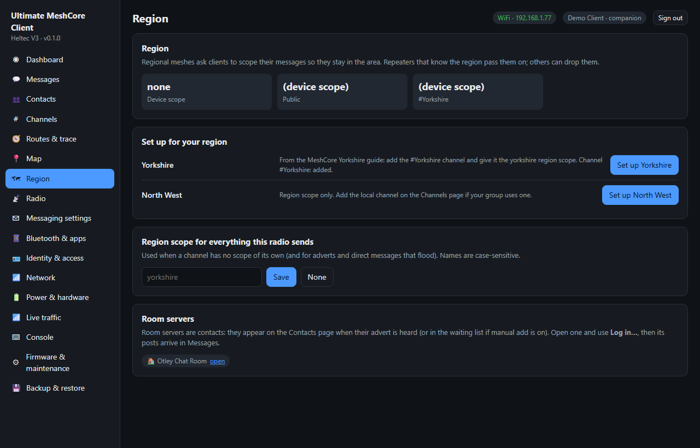

### Map
Your node and every contact that shares a location.

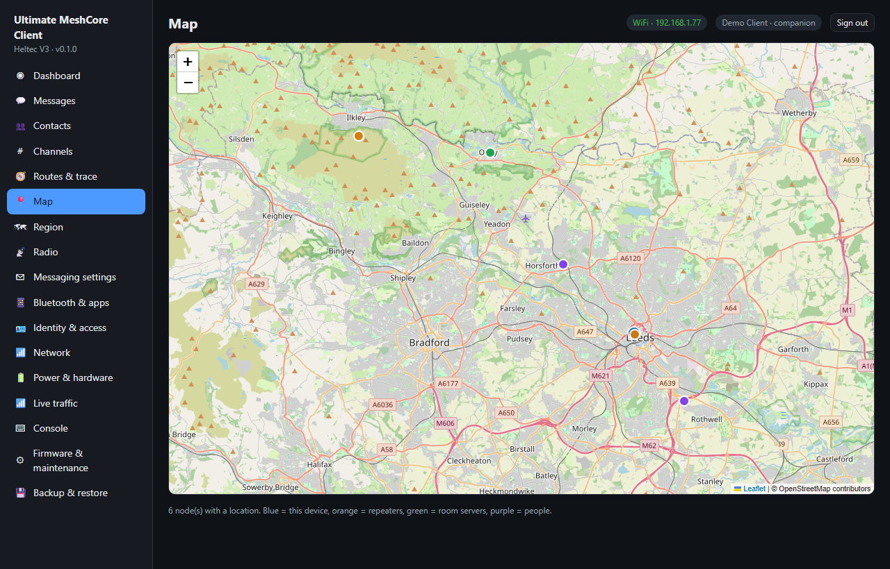

### Client settings and app links
- **Messaging**: extra ACKs, path hash size, location sharing and client repeat.
- **Contacts**: auto-add rules and hop limit.
- **Telemetry** permissions.
- **Radio**: airtime factor and RX delay.
- **App links**: Bluetooth PIN, app connections, and live status of each app link.
- **Dashboard and display WiFi page**: network, IP, `.local` name, hotspot and connected apps. The pairing PIN shows until an app connects.
- The client has the same web interface, WiFi, updates, rollback and watchdog as the repeater.

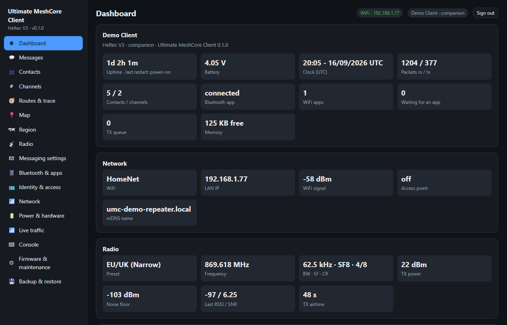

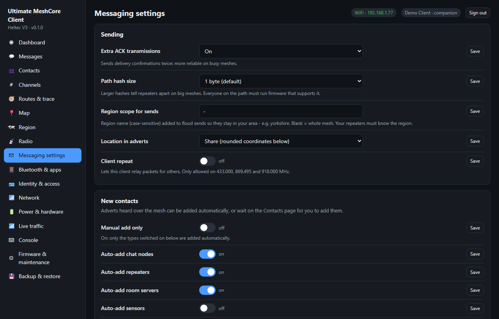

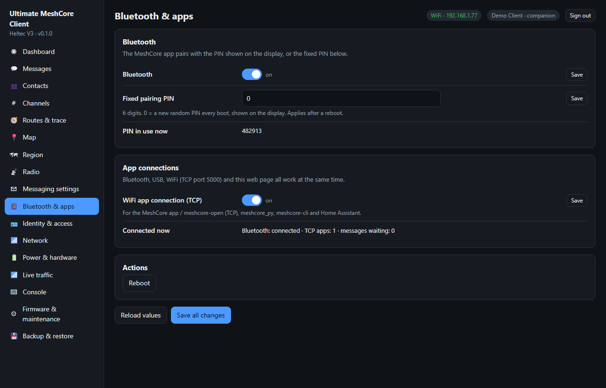

The messenger also works on a phone browser:

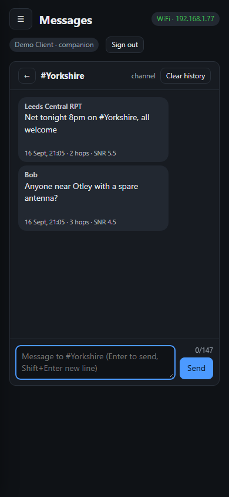

---

## T-Deck / T-Deck Plus touch client

- **Touch interface** on the 320x240 screen, with the keyboard and trackball. Tabs for messages, contacts, map and info.
- **Offline maps from the SD card**, with your position and contacts plotted. `scripts/umc_make_map_tiles.py` builds the tiles.
- Without tiles, contacts are plotted by range and bearing, with distance rings.
- **GPS auto-detection** for both receivers used on the T-Deck Plus (u-blox at 38400 baud, L76K at 9600).
- The same Bluetooth, USB and WiFi app links, web interface and updates as the other client builds.

---

## Ultimate MeshCore App (Android)

- Connects over **Bluetooth** or **WiFi (TCP 5000)** to the Ultimate MeshCore Client and other compatible companion radios.
- **Messages**: delivery ticks and retry.
- **Contacts**:
  - login, status, telemetry, trace and path discovery;
  - **set route**;
  - a **remote admin console**.
- **Channels**, including region scope and one-tap Yorkshire setup.
- A **map** of everyone who shares a location.
- **Radio settings**: presets, frequency, power, name, location, confirmations and Bluetooth PIN.
- **Device tab**: opens the full web interface of any UMC repeater or client on your network, including firmware updates.
- Source is in [`android/`](android/). CI builds it into an installable APK ([download](https://github.com/2E0LXY/ultimate-meshcore/releases/tag/app-latest)).

| Messages | Contacts | Channels |
|---|---|---|
| 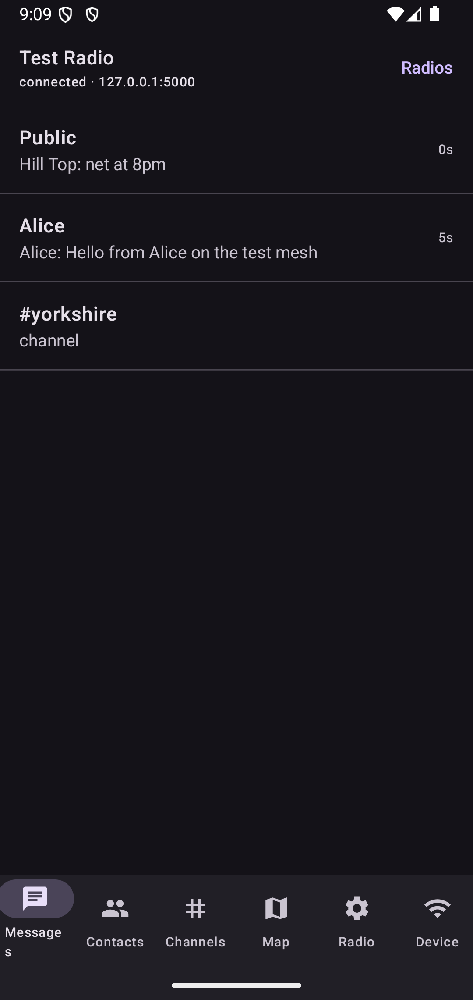 | 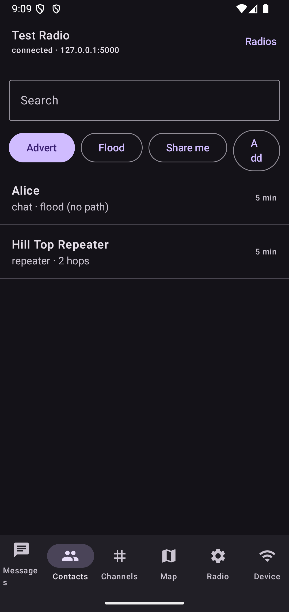 | 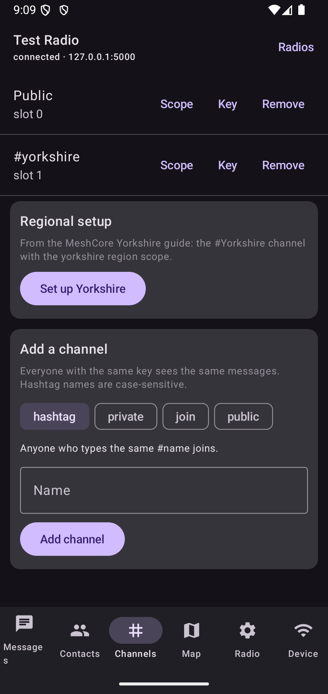 |
| **Radio** | **Map** | |
| 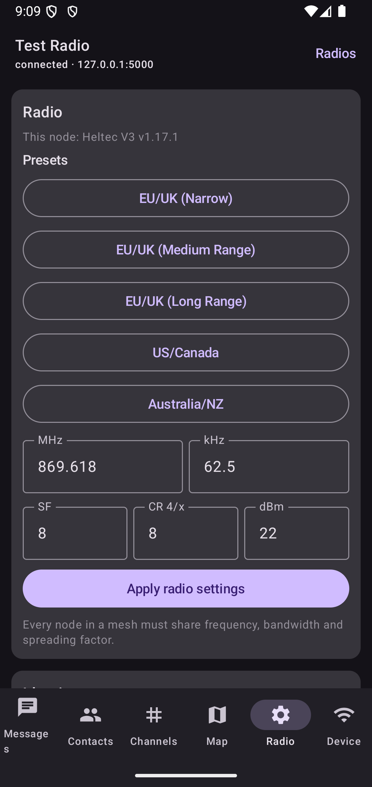 | 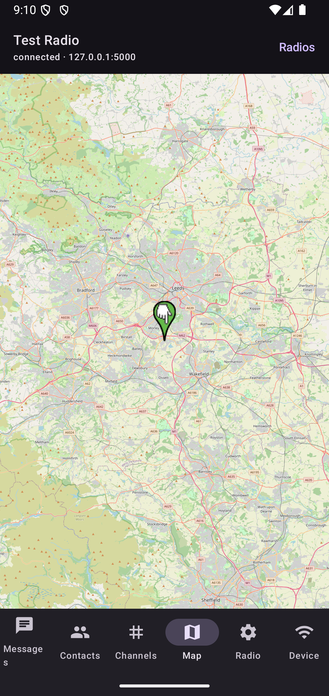 | |

---

## Ultimate MeshCore Desktop (Windows / Linux)

The complete interface on your computer, for any radio you can reach, including ones without WiFi.

- **USB**:
  - repeaters, room servers and client radios, with every page of the web interface;
  - **firmware updates over USB**, keeping identity and settings.
- **Bluetooth** and **WiFi app link (TCP 5000)**: client radios, with messages, contacts, channels, routes and trace, map, region scope and settings.
- **On your network**:
  - any Ultimate MeshCore repeater or client, with its own web interface;
  - **Search this network** finds them.
- **Other MeshCore companion radios**: messages, contacts, channels, map and the common settings.
- **Everyday use**: recent connections, automatic reconnect after a restart, and its own window.
- **Downloads**: a single `.exe` for Windows, and a `.tar.gz` with an installer for Linux ([download](https://github.com/2E0LXY/ultimate-meshcore/releases/tag/desktop-latest)). Source is in [`desktop/`](desktop/).

| Connection page | Messages |
|---|---|
| 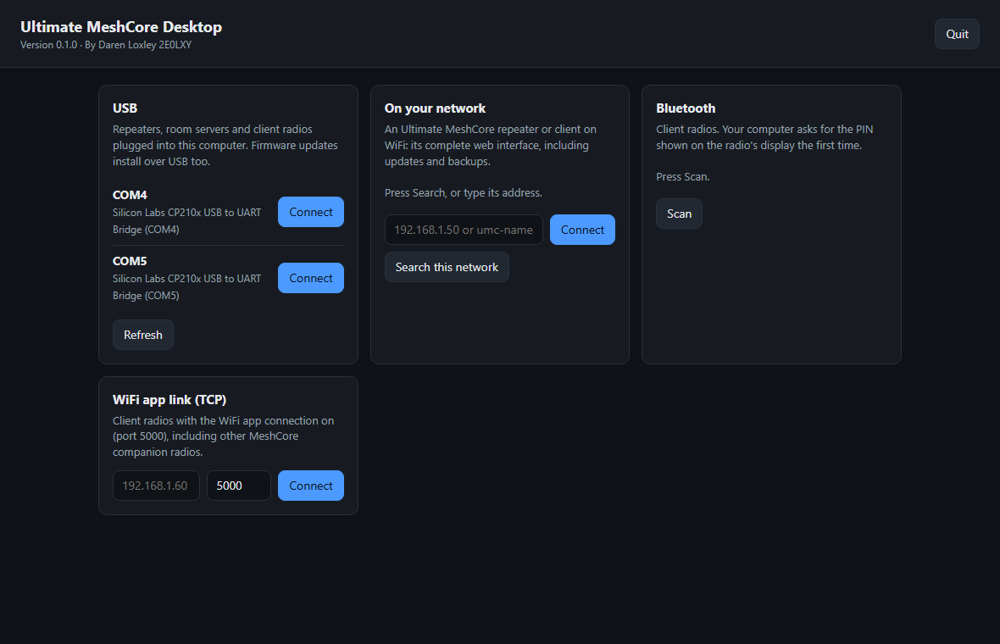 | 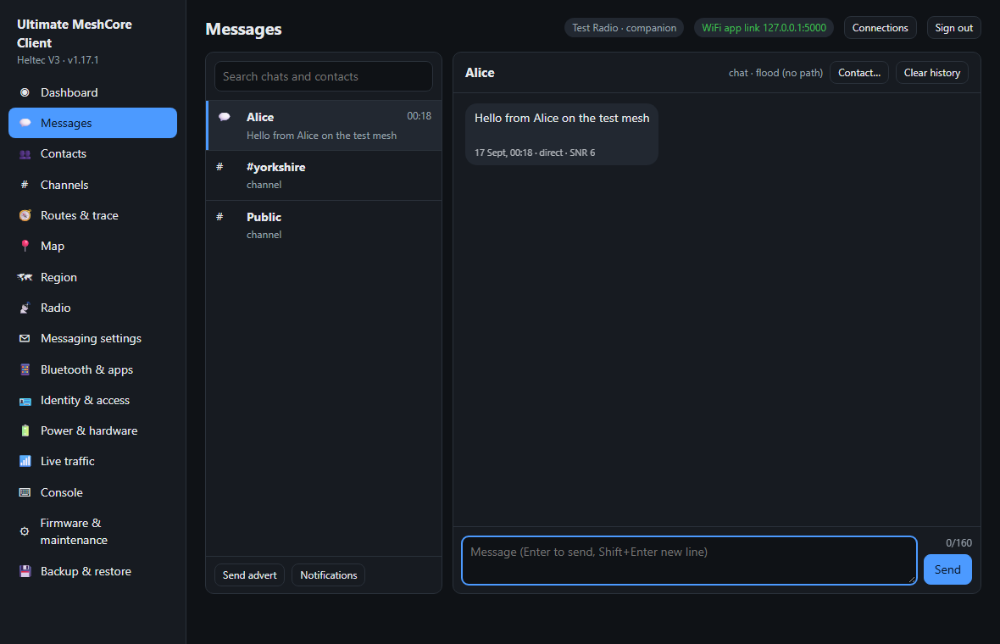 |

---

## Command line

Every setting in the web interface is also a command. Commands work over USB serial, telnet, the web console, or remote admin over the mesh.

```
wifi.ssid, wifi.pwd, wifi.ssid2/3, wifi.pwd2/3, wifi clear, wifi scan, get wifi.scan, wifi.enabled, get wifi.networks, wifi.status, wifi reconnect
net.ip, net.hostname, net.mdns, get net.status
ap.mode, ap.password, ap.rescue, get ap.status, pin
http, http.timeout, telnet, timezone, app.tcp, get app.status
display.mode, display.ip, display.page, display.traffic, display.timeout
region preset yorkshire|northwest|uk, get traffic, group.hops.max, advert.hops.max
routes, route <node>, route find|pin|unpin|forget, trace <path>, trace route <node>, get trace
update check, update install, get update.status, update.auto, update.interval, update.url, get build
get ota.state, ota rollback
get setup, setup start, setup done, get umc.version, factory reset confirm

client: name, lat/lon, radio, tx, radio.rxgain, af, rxdelay, repeat, path.hash.mode, multi.acks,
        advert, advert.flood, advert.loc, contacts.manual, autoadd.*, telemetry.*, scope,
        get contacts.count, ble, ble.pin, get ble.activepin, get app.links, gps, clock, stats, memory
```

The full list with explanations is in the [manual's command reference](docs/umc/MANUAL.md#24-command-reference-az).

---

## Building

```bash
git clone https://github.com/2E0LXY/ultimate-meshcore
cd ultimate-meshcore
pio run -e umc_heltec_v3_repeater            # repeater
pio run -e umc_heltec_v3_repeater -t upload  # build and flash over USB
pio run -e umc_heltec_v3_client              # Ultimate MeshCore Client
pio run -e umc_lilygo_tdeck_client           # T-Deck / T-Deck Plus client
```

- **Targets:** [`variants/umc/platformio.ini`](variants/umc/platformio.ini)
- **Web UI source:** [`web/umc/index.html`](web/umc/index.html), gzipped into the firmware at build time.
  - To try it against a simulated device, serve `web/umc/` locally and open one of:
    - `index.html?mock` (repeater)
    - `index.html?mock=setup` (setup wizard)
    - `index.html?mock=client` (client)
  - [`scripts/umc_screenshots.py`](scripts/umc_screenshots.py) regenerates the screenshots in this README.
- **Web flasher:** [`flasher/`](flasher/), published by [`.github/workflows/umc-firmware.yml`](.github/workflows/umc-firmware.yml)
- **Android app:** `cd android && ./gradlew assembleDebug`
- **Desktop app:** `cd desktop && pip install -r requirements.txt && python -m umc_desktop` (build with `python build.py`)

## Documentation

| Document | Contents |
|---|---|
| [MANUAL.md](docs/umc/MANUAL.md) | Complete user guide: installation, every setting, troubleshooting, command reference and glossary |
| [ROADMAP.md](docs/umc/ROADMAP.md) | What's coming next |
| [SPEC.md](docs/umc/SPEC.md) | Design specification |
| [android/README.md](android/README.md) | The Ultimate MeshCore App for Android |
| [desktop/README.md](desktop/README.md) | Ultimate MeshCore Desktop for Windows and Linux |

## Author

**Daren Loxley 2E0LXY** · umc@2e0lxy.uk

## License

MIT — see [license.txt](license.txt).
